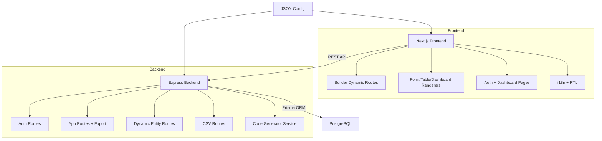

# AI App Generator - Implementation Plan (Current)

## Goal
Build and harden a config-driven full-stack runtime that reads JSON app definitions and powers dynamic UI, API, storage, and export workflows.

## Current State Summary (May 2026)

### Implemented
- Monorepo with workspaces: client, server, shared.
- Next.js frontend with app router and dynamic builder routes.
- Express + TypeScript backend with auth, app management, dynamic entity CRUD, CSV, and export.
- Prisma-backed persistence for users, apps, records, notifications, and email deliveries.
- Config-driven renderers for table, form, and dashboard pages.
- Config-driven code generator that exports runnable app source code ZIP.
- i18n support (including RTL handling).
- Notification stream and email delivery pipeline.

### Recently Improved
- Unified branding icon usage across navbar, favicon, and generated apps.
- Defensive renderer behavior for missing/incomplete config fields.
- README documentation refresh across repo README files.

### Remaining Gaps
- Automated test coverage is still limited.
- CI pipeline is basic and should be expanded with lint and tests.
- Deployment runbook and production hardening still need completion.

## Architecture Overview



## Repository Structure (Aligned to Current Repo)

```text
project-root/
|- client/
|  |- src/app/
|  |  |- page.tsx
|  |  |- login/
|  |  |- register/
|  |  |- dashboard/
|  |  `- builder/[appId]/[[...slug]]/
|  |- src/components/renderers/
|  |- src/lib/
|  `- public/
|- server/
|  |- prisma/schema.prisma
|  `- src/
|     |- index.ts
|     |- middleware/auth.ts
|     |- routes/
|     |  |- auth.ts
|     |  |- apps.ts
|     |  |- entity.ts
|     |  `- csv.ts
|     |- services/
|     |  |- config-engine.ts
|     |  |- entity-service.ts
|     |  |- csv-service.ts
|     |  `- code-generator.ts
|     `- shared/
|- shared/src/
|- configs/
|- README.md
`- package.json
```

## Functional Scope

### 1. Config Runtime
- Validate app config shape and normalize defaults.
- Resolve pages and entities at runtime.
- Render UI from page and field metadata.

### 2. Dynamic Frontend Rendering
- Table pages with search/filter/actions.
- Form pages with field-type-specific inputs.
- Dashboard pages with stats/charts/lists.
- Safe fallbacks for unknown or missing config nodes.

### 3. Dynamic Backend Data Plane
- Entity-scoped CRUD endpoints.
- Stats and recent-data endpoints for dashboards.
- CSV import workflow.
- User-scoped data filtering for protected entities.

### 4. Export Pipeline
- Generate full app codebase from config.
- Include app pages, API routes, schema, env template, and icon assets.
- Package generated files as ZIP download.

## API Surface (Current)

### Auth
- `POST /api/auth/register`
- `POST /api/auth/login`
- OAuth start/callback endpoints for provider login

### Apps
- `POST /api/apps`
- `GET /api/apps`
- `GET /api/apps/:id`
- `DELETE /api/apps/:id`
- `GET /api/apps/:id/export`

### Entities
- `GET /api/entities/:appId/:entityName`
- `GET /api/entities/:appId/:entityName/:id`
- `POST /api/entities/:appId/:entityName`
- `PUT /api/entities/:appId/:entityName/:id`
- `DELETE /api/entities/:appId/:entityName/:id`
- `GET /api/entities/:appId/:entityName/stats`
- `GET /api/entities/:appId/:entityName/recent`

### CSV
- CSV upload/import endpoints under `/api/csv`

## Quality and Reliability Plan

### Phase A - Baseline Hardening (High Priority)
1. Enforce strict type checks in all workspaces.
2. Add lint checks for client and server in CI.
3. Add unit tests for config validator and config engine.
4. Add integration tests for apps and entity route flows.

### Phase B - Generator Reliability (High Priority)
1. Snapshot test generated file tree for sample configs.
2. Validate generated project builds in CI smoke tests.
3. Add tests for malformed config fallback behavior.

### Phase C - Security and Ops (Medium Priority)
1. Add auth endpoint rate limiting.
2. Add structured logging and request IDs.
3. Add environment validation at server boot.
4. Add production-ready deployment guides.

### Phase D - Product Maturity (Medium Priority)
1. Expand dashboard/chart options from config.
2. Improve relation field UX and validation.
3. Add import/export diagnostics UI.

## Edge Case Strategy

| Scenario | Handling |
|---|---|
| Missing page config | Skip invalid page and show warning/fallback |
| Unknown field type | Render safe fallback input |
| Missing required input | Field-level validation errors |
| Extra payload fields | Strip before persistence |
| Empty entity data | Empty-state UI with action CTA |
| Invalid CSV rows | Row-level error reporting |
| Incompatible old records | Render available fields only |

## Verification Plan

### Automated
1. Config validation tests with valid/invalid fixtures.
2. Entity route tests for create/list/update/delete and user scope.
3. Generator tests that assert required files and icon consistency.
4. Build smoke tests for root, client, and server.

### Manual
1. Load task-manager config and verify all configured pages.
2. Load inventory config and verify renderer adaptation.
3. Verify auth flow and user-scoped records.
4. Verify export ZIP can run after install/build.
5. Verify mobile layout and RTL behavior.

## Delivery Checklist
- [x] Config runtime implemented.
- [x] Dynamic frontend renderers implemented.
- [x] Dynamic backend entity layer implemented.
- [x] Export pipeline implemented.
- [ ] Full automated test suite completed.
- [ ] CI expanded with lint + tests + generator smoke checks.
- [ ] Deployment runbook finalized.

## Next Action Items
1. Add server and shared test scaffolding (Vitest/Jest).
2. Add API integration tests for apps and entities.
3. Add generator snapshot tests.
4. Expand CI to run lint, tests, and build matrix.
5. Add production env validation and startup checks.
