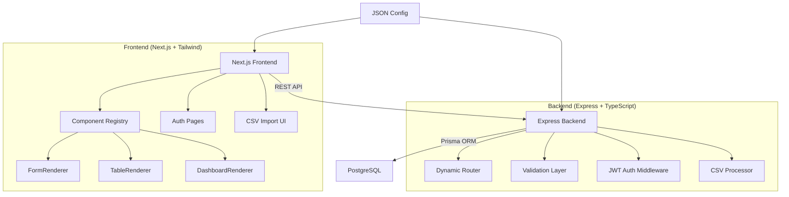

# Track A: AI App Generator — Implementation Plan

## Goal
Build a **config-driven full-stack runtime** that reads a JSON configuration and dynamically generates forms, tables, dashboards, REST APIs, and database structures. Like a mini [Base44](https://base44.com/) — not a single hardcoded app, but a **system that generates apps from config**.

---

## Architecture Overview



---

## Monorepo Structure

```
project-root/
├── client/                    # Next.js 14 (App Router)
│   ├── src/
│   │   ├── app/               # Pages (app router)
│   │   │   ├── layout.tsx
│   │   │   ├── page.tsx       # Home / config loader
│   │   │   ├── login/
│   │   │   ├── register/
│   │   │   └── app/[...slug]/ # Dynamic page renderer
│   │   ├── components/
│   │   │   ├── renderers/     # FormRenderer, TableRenderer, DashboardRenderer
│   │   │   ├── ui/            # Button, Input, Card, Modal, etc.
│   │   │   ├── layout/        # Sidebar, Navbar, AppShell
│   │   │   └── csv/           # CSVUploader, ColumnMapper
│   │   ├── lib/
│   │   │   ├── api-client.ts  # Axios wrapper
│   │   │   ├── config-parser.ts
│   │   │   ├── auth-context.tsx
│   │   │   └── component-registry.ts
│   │   └── types/
│   ├── tailwind.config.ts
│   └── package.json
│
├── server/                    # Express + TypeScript
│   ├── src/
│   │   ├── index.ts           # Entry point
│   │   ├── routes/
│   │   │   ├── auth.ts        # Login/register/me
│   │   │   ├── config.ts      # Load/save config
│   │   │   ├── entity.ts      # Dynamic CRUD router
│   │   │   └── csv.ts         # CSV upload endpoint
│   │   ├── middleware/
│   │   │   ├── auth.ts        # JWT verification
│   │   │   └── validate.ts    # Dynamic validation
│   │   ├── services/
│   │   │   ├── config-engine.ts
│   │   │   ├── entity-service.ts
│   │   │   └── csv-service.ts
│   │   └── prisma/
│   │       └── schema.prisma
│   └── package.json
│
├── shared/                    # Shared types & config validation
│   ├── types.ts
│   └── config-validator.ts
│
├── configs/                   # Sample JSON configs
│   ├── task-manager.json
│   └── inventory.json
│
└── package.json               # Workspace root
```

---

## JSON Config Schema

```typescript
interface AppConfig {
  app: {
    name: string;
    description?: string;
    theme?: { primaryColor?: string; mode?: "light" | "dark" };
    auth: { enabled: boolean };
  };
  entities: Record<string, EntityConfig>;
  pages: PageConfig[];
}

interface EntityConfig {
  fields: Record<string, FieldConfig>;
  displayField?: string;      // Which field to use as label
  userScoped?: boolean;        // Records belong to logged-in user
}

interface FieldConfig {
  type: "string" | "text" | "number" | "boolean" | "date" | "email" | "enum" | "relation";
  required?: boolean;
  default?: any;
  label?: string;
  options?: string[];          // enum values
  min?: number;
  max?: number;
  entity?: string;             // relation target
}

type PageConfig =
  | { type: "table"; name: string; path: string; entity: string;
      columns: string[]; actions?: string[]; filters?: string[];
      searchable?: boolean; pageSize?: number }
  | { type: "form"; name: string; path: string; entity: string;
      fields?: string[] }
  | { type: "dashboard"; name: string; path: string;
      widgets: WidgetConfig[] };

interface WidgetConfig {
  type: "stat" | "chart" | "list";
  label: string;
  entity: string;
  operation?: "count" | "sum" | "avg";
  field?: string;
  groupBy?: string;
  chartType?: "bar" | "pie" | "line";
}
```

### Sample Config (Task Manager)

```json
{
  "app": { "name": "Task Manager", "auth": { "enabled": true } },
  "entities": {
    "task": {
      "userScoped": true,
      "displayField": "title",
      "fields": {
        "title":       { "type": "string", "required": true, "label": "Task Title" },
        "description": { "type": "text" },
        "status":      { "type": "enum", "options": ["todo","in_progress","done"], "default": "todo" },
        "priority":    { "type": "number", "min": 1, "max": 5 },
        "dueDate":     { "type": "date" }
      }
    }
  },
  "pages": [
    { "type": "table", "name": "Tasks", "path": "/tasks", "entity": "task",
      "columns": ["title","status","priority","dueDate"],
      "actions": ["create","edit","delete"], "filters": ["status","priority"],
      "searchable": true },
    { "type": "form", "name": "New Task", "path": "/tasks/new", "entity": "task" },
    { "type": "dashboard", "name": "Dashboard", "path": "/dashboard",
      "widgets": [
        { "type": "stat", "label": "Total Tasks", "entity": "task", "operation": "count" },
        { "type": "stat", "label": "Completed", "entity": "task", "operation": "count" },
        { "type": "chart", "label": "By Status", "entity": "task", "groupBy": "status", "chartType": "pie" }
      ]
    }
  ]
}
```

---

## Database Design (Prisma + JSONB)

> [!IMPORTANT]
> We use a **fixed core schema** with a **JSONB `data` column** for entity records. This lets the system handle ANY config without DDL changes — critical for a "config-driven" runtime.

```prisma
model User {
  id        String   @id @default(uuid())
  email     String   @unique
  password  String
  name      String?
  createdAt DateTime @default(now())
  updatedAt DateTime @updatedAt
  records   Record[]
}

model AppConfig {
  id        String   @id @default(uuid())
  name      String
  config    Json     // The full JSON config
  isActive  Boolean  @default(true)
  createdAt DateTime @default(now())
  updatedAt DateTime @updatedAt
}

model Entity {
  id        String   @id @default(uuid())
  configId  String
  name      String   // "task", "product", etc.
  schema    Json     // Field definitions from config
  records   Record[]
  createdAt DateTime @default(now())
  @@unique([configId, name])
}

model Record {
  id        String   @id @default(uuid())
  entityId  String
  entity    Entity   @relation(fields: [entityId], references: [id], onDelete: Cascade)
  userId    String?
  user      User?    @relation(fields: [userId], references: [id])
  data      Json     // Actual record data as JSONB
  createdAt DateTime @default(now())
  updatedAt DateTime @updatedAt
  @@index([entityId])
  @@index([userId])
}
```

---

## Backend API Design

### Auth Endpoints
| Method | Path | Description |
|--------|------|-------------|
| POST | `/api/auth/register` | Register (email + password) |
| POST | `/api/auth/login` | Login → returns JWT |
| GET | `/api/auth/me` | Get current user (protected) |

### Config Endpoints
| Method | Path | Description |
|--------|------|-------------|
| POST | `/api/config` | Upload/activate a config |
| GET | `/api/config/active` | Get active config |

### Dynamic Entity Endpoints (auto-generated from config)
| Method | Path | Description |
|--------|------|-------------|
| GET | `/api/entities/:entityName` | List records (paginated, filtered, sorted) |
| GET | `/api/entities/:entityName/:id` | Get single record |
| POST | `/api/entities/:entityName` | Create record (validated against schema) |
| PUT | `/api/entities/:entityName/:id` | Update record |
| DELETE | `/api/entities/:entityName/:id` | Delete record |
| GET | `/api/entities/:entityName/stats` | Aggregation stats for dashboards |
| POST | `/api/entities/:entityName/csv` | CSV import |

### Dynamic Validation Layer
- Reads entity schema from config
- Validates every field: type checks, required fields, enum values, min/max
- Strips unknown fields
- Applies defaults for missing optional fields
- Returns field-level error messages

---

## Frontend Components

### Component Registry Pattern
```typescript
const COMPONENT_REGISTRY = {
  table: TableRenderer,
  form: FormRenderer,
  dashboard: DashboardRenderer,
};

// PageRenderer picks the right component, or shows a fallback
function PageRenderer({ pageConfig }) {
  const Component = COMPONENT_REGISTRY[pageConfig.type] || FallbackRenderer;
  return <Component config={pageConfig} />;
}
```

### Key Renderers

**FormRenderer** — Reads entity fields → renders appropriate input for each type:
- `string` → text input
- `text` → textarea
- `number` → number input with min/max
- `boolean` → toggle/checkbox
- `date` → date picker
- `email` → email input with validation
- `enum` → select dropdown
- `relation` → searchable select (fetches related entity records)
- Unknown type → text input fallback

**TableRenderer** — Renders entity data in a table with:
- Dynamic columns from config
- Server-side pagination
- Sorting (click column headers)
- Filters (from config filter fields)
- Search bar (if `searchable: true`)
- Action buttons (create/edit/delete)
- Empty state, loading skeleton, error state

**DashboardRenderer** — Renders widgets:
- `stat` → card with count/sum/avg value
- `chart` → bar/pie/line chart (using Recharts)
- `list` → recent records list

### CSV Import Flow
1. User clicks "Import CSV" on a table page
2. Modal opens → user uploads `.csv` file
3. Client parses CSV with `papaparse` → extracts headers
4. Column mapper UI: map CSV columns → entity fields
5. Preview table shows first 5 rows with mapped data
6. Submit → backend validates + stores each row
7. Results summary: X imported, Y skipped (with reasons)

---

## Edge Case Handling Strategy

| Scenario | How We Handle It |
|----------|-----------------|
| Missing fields in config | Use defaults, skip gracefully |
| Unknown page type | Render `FallbackRenderer` with warning |
| Unknown field type | Default to string/text input |
| Missing required data | Block submit, show field-level errors |
| Extra fields in data | Strip on backend before storing |
| Empty entity (no records) | Show empty state with CTA |
| Invalid API response | Error boundary + retry button |
| Malformed CSV | Show parse error with line number |
| CSV type mismatch | Report per-row errors in results |
| Config with no pages | Show "No pages configured" state |
| Circular relations | Detect on config load, show warning |
| Schema mismatch (old data vs new config) | Render available fields, skip missing |

---

## 3 Mandatory Features

### 1. JWT Authentication
- bcrypt for password hashing
- JWT tokens (access token in localStorage, 24h expiry)
- Auth middleware on all entity routes
- User-scoped data: `userScoped: true` entities filter by `userId`
- Protected routes on frontend via `AuthContext` + redirect

### 2. CSV Import System
- `papaparse` for client-side CSV parsing
- Interactive column mapping UI
- Server-side validation against entity schema
- Batch insert with per-row error tracking
- Handles: empty rows, type coercion, missing columns

### 3. Responsive UI (Tailwind CSS)
- Mobile-first responsive design across all pages
- Sidebar collapses to hamburger menu on mobile
- Tables scroll horizontally on small screens
- Forms stack vertically
- Dashboard widgets reflow in grid

---

## Tech Stack Summary

| Layer | Technology |
|-------|-----------|
| Frontend | Next.js 14 (App Router), TypeScript, Tailwind CSS |
| Charts | Recharts |
| CSV Parsing | PapaParse |
| Backend | Express.js, TypeScript |
| Auth | jsonwebtoken, bcryptjs |
| Database | PostgreSQL |
| ORM | Prisma |
| Validation | Zod (shared schemas) |
| Deployment | Vercel (frontend) + Railway (backend) + Neon (PostgreSQL) |

---

## Proposed Changes (Build Order)

### Phase 1: Project Setup & Shared Types
- Initialize monorepo with npm workspaces
- Set up `shared/` with TypeScript types and Zod config validator
- Create sample configs in `configs/`

### Phase 2: Backend Core
#### [NEW] server/src/prisma/schema.prisma
Core database schema (User, AppConfig, Entity, Record)

#### [NEW] server/src/index.ts
Express server setup with CORS, JSON parsing, error handling

#### [NEW] server/src/routes/auth.ts
Register/login/me endpoints with JWT

#### [NEW] server/src/routes/config.ts
Config upload + activation + entity sync

#### [NEW] server/src/routes/entity.ts
Dynamic CRUD router with validation

#### [NEW] server/src/routes/csv.ts
CSV upload + validation + batch import

#### [NEW] server/src/middleware/auth.ts
JWT verification middleware

#### [NEW] server/src/middleware/validate.ts
Dynamic validation using entity schema

#### [NEW] server/src/services/config-engine.ts
Config parsing, entity syncing, schema management

#### [NEW] server/src/services/entity-service.ts
CRUD operations with JSONB queries, filtering, pagination, stats

### Phase 3: Frontend Core
#### [NEW] client/ (Next.js project)
Initialize with `create-next-app`

#### [NEW] client/src/lib/api-client.ts
Axios instance with JWT interceptor

#### [NEW] client/src/lib/auth-context.tsx
React context for auth state

#### [NEW] client/src/lib/config-parser.ts
Config loading and page routing

#### [NEW] client/src/lib/component-registry.ts
Maps page types → renderer components

#### [NEW] client/src/components/renderers/FormRenderer.tsx
Dynamic form generation from entity fields

#### [NEW] client/src/components/renderers/TableRenderer.tsx
Dynamic table with sort/filter/paginate/search

#### [NEW] client/src/components/renderers/DashboardRenderer.tsx
Dynamic dashboard with stat/chart/list widgets

#### [NEW] client/src/components/csv/CSVImporter.tsx
CSV upload, column mapping, preview, submit

#### [NEW] client/src/app/ pages
Login, Register, dynamic app pages

### Phase 4: Polish & Deploy
- Responsive design audit
- Error boundaries everywhere
- Loading skeletons
- Deploy frontend to Vercel
- Deploy backend to Railway
- Deploy PostgreSQL to Neon

---

## Verification Plan

### Automated Tests
1. **Config modification test**: Change the JSON config (add/remove fields, rename entities) → system should adapt without breaking
2. **Edge case test**: Submit incomplete data, unknown field types, empty config → system handles gracefully
3. **API tests**: Hit all CRUD endpoints with valid and invalid data
4. **CSV test**: Upload CSVs with missing columns, wrong types, extra columns

### Manual Verification
1. Load a Task Manager config → verify forms, tables, dashboard all render
2. Load a completely different config (e.g., Inventory system) → verify the system adapts
3. Register, login, verify user-scoped data
4. Import CSV, verify data appears in table
5. Test on mobile viewport → verify responsive layout
6. Modify config while system is running → verify it updates

---

## Open Questions

> [!IMPORTANT]
> **Config hot-reload**: Should the system reload the config from DB on every request, or cache it? I recommend **caching with manual reload** for performance.

> [!NOTE]  
> **Second sample config**: I'll build two sample configs (Task Manager + Inventory/CRM) to prove the system is truly config-driven and not hardcoded for one app.

> [!NOTE]
> **Deployment**: Are you already set up with Vercel/Railway/Neon accounts, or should I help with that during deployment phase?
